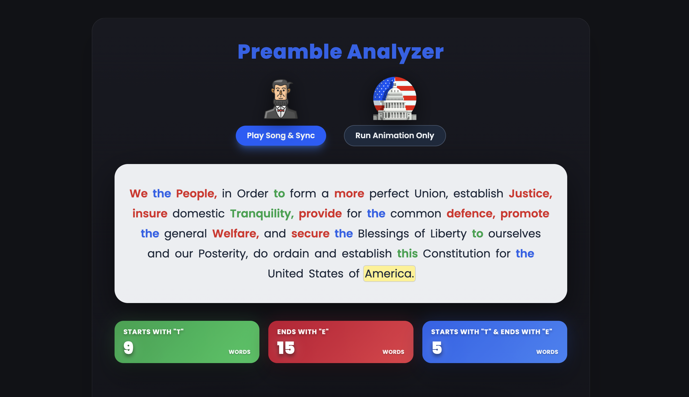

# Preamble to the Constitution Analyzer



An interactive React application that animates, analyzes, and visually highlights the Preamble to the Constitution of the United States of America. The app synchronizes text with audio playback or runs independently in animation mode, while tracking and categorizing word patterns in real time.

This project demonstrates React state management, animation loops, media synchronization, and real-time text analysis in a clean, accessible UI.

⸻

What This App Does

The application progressively displays the words of the U.S. Constitution’s Preamble and highlights them one-by-one as the animation runs.

As the text advances, the app:
	•	Highlights the currently active word
	•	Visually marks words that:
	•	Start with the letter “t”
	•	End with the letter “e”
	•	Start with “t” and end with “e”
	•	Counts each qualifying word only once to ensure accurate results
	•	Pauses briefly on the word “Tranquility” to emphasize its significance
	•	Displays live statistics that update as the text progresses

The animation can run in two modes:
	•	Video-synchronized mode, aligned with a Schoolhouse Rock video
	•	Manual animation mode, which runs independently of the video

⸻

Key Features
	•	React + Vite modern frontend setup
	•	YouTube IFrame API integration for precise media synchronization
	•	requestAnimationFrame-based animation loop for smooth word progression
	•	Manual animation fallback when video playback is not desired
	•	Real-time word analysis and counting
	•	Pause-on-keyword logic for controlled emphasis
	•	Clean, responsive design for desktop, tablet, and mobile
	•	Visually accessible color-coding for word classifications

⸻

Word Highlighting Rules

As the animation runs:
	•	🟩 Green — words starting with “t”
	•	🟥 Red — words ending with “e”
	•	🟦 Blue — words starting with “t” and ending with “e”
	•	🟨 Yellow highlight — currently active word

Each word is counted once, even if the animation loops or pauses.

⸻

Technology Stack
	•	React (functional components & hooks)
	•	Vite (fast development & build tooling)
	•	YouTube IFrame API
	•	CSS + Tailwind utility classes
	•	requestAnimationFrame & refs for precise timing control

## Features

- Built with React and Vite
- Clean, modern design with a gradient background
- Responsive layout that works on desktop, tablet, and mobile devices
- Elegant typography using serif fonts
- Smooth animations and transitions

## Getting Started

### Prerequisites

- Node.js (version 14 or higher)
- npm or yarn

### Installation

1. Install dependencies:
```bash
npm install
```

### Development

Run the development server:
```bash
npm run dev
```

The app will be available at `http://localhost:5173` (or the port Vite assigns).

### Build for Production

Build the app for production:
```bash
npm run build
```

The built files will be in the `dist` directory.

### Preview Production Build

Preview the production build locally:
```bash
npm run preview
```

## Project Structure

```
my-preamble/
├── src/
│   ├── App.jsx          # Main React component
│   ├── App.css          # Component styles
│   ├── main.jsx         # React entry point
│   └── index.css        # Global styles
├── index.html           # HTML template
├── package.json         # Dependencies and scripts
├── vite.config.js       # Vite configuration
└── README.md            # This file
```

## Browser Compatibility

Works on all modern browsers including:
- Chrome
- Firefox
- Safari
- Edge

## Customization

You can easily customize the colors, fonts, and layout by editing `src/App.css`. The design uses modern CSS features for easy customization.

